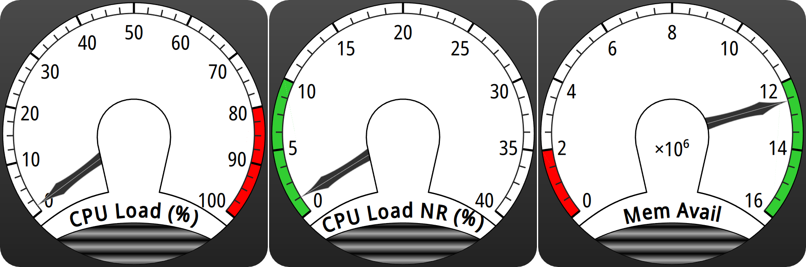

# S5W Dial (QML)

This repository contains my work to port my [C++ Qt analog meter
widget](https://bitbucket.org/mpyne/dial-demo/) to use native QML instead. This
permits a much more efficient GPU-accelerated scene graph to be used (as long
as you have a GPU, but basically everyone does in 2021, even on mobile).

The result looks like this:



In motion, it looks like this:

[](dial-video.webm)

## Dependencies

* [Qt 5](https://doc.qt.io/qt-5/index.html), with:
  * QML,
  * Qt Quick, and
  * Qt Quick Shapes installed.
* [Google Noto Sans](https://fonts.google.com/specimen/Noto+Sans) font for best results
* (Optional) KDE [Plasma 5](https://kde.org/plasma-desktop/)

## Synopsis

    $ make test    (this uses `qmlscene` to show 3 specific sensors as an example)

If you are using a KDE Plasma 5 system you can also install a Plasmoid widget
using this meter:

    $ make install_plasmoid

Once installed, you should be able to add an analog meter using the 'Add
Widgets' function in Plasma.  You will currently need to configure the widget
once you've dragged it onto your desktop to change the data source to use one
of the base KSysGuard sensors.

There are many available KSysGuard sensors. You can find their names by
running KSysGuard yourself and viewing its list of sensors. The names look like
some of these examples:

* `mem/physical/available`  (which lists available physical memory)
* `cpu/system/TotalLoad`    (which shows overall system load across all CPUs)

## Usage

As a QML developer, the widget should be as simple as dropping the S5WDial.qml
where you need it, accounting for your `qmldir` import paths as necessary, and
declaring the widget where appropriate in your item hierarchy.

See [test.qml](test.qml) for an example, but here's what it looks like:

```qml
    S5WDial {
        id: base_dial_narrow
        minimum: 0.0
        maximum: 40.0

        Layout.minimumHeight: 100
        Layout.minimumWidth: 100
        Layout.fillHeight: true
        Layout.fillWidth: true

        numTicks: 8
        label: "CPU Load NR (%)"

        useDesiredArea: true
        desiredLow: 0.0
        desiredHigh: 10.0

        Connections {
            target: cpu_meter
            function onSensorOutput(value) {
                base_dial_narrow.value = value
            }
        }
    }
```

To define the meter range on its face, change the `minimum` and `maximum`
properties. To position the needle on the fact, update the `value` property (a
`real` which should be between `minimum` and `maximum`). Currently the position
update is animated but no other input smoothing is performed.

In this example, there is a separate QML item acting as a sensor and the
`Connections` object here is used to feed that output into the meter. Other
methods can work as well.

### Color bands

There are two possible color bands you can apply to the tick marks on the dial face:

1. Red bands, meant to represent a warning area.  To use this, set
   `useWarningArea` to `true` and then set the `warnLow` and `warnHigh`
   properties such that they are contained within the dial range.
2. Green bands, meant to represent a nominal operating area, even if other
   areas are not problematic.  To use this, set `useDesiredArea` to `true` and
   then set the `desiredLow` and `desiredHigh` properties as above.

### Label unit scaling

To make the label text on the unit face more readable, the dial will
automatically elide decimal digits based on the size of the `maximum` property,
until face values are <= 1,000.

In this case, the dial will show a label in the center that reads like “×10⁶”
and will automatically reduce values that are fed-in by the amount shown. So
you should not need to do anything special for values as long as they are
between `minimum` and `maximum`.

## How it Works

There is no SVG anywhere (though we do generate SVG for a couple of elements
where it's the easiest way to combine multiple related paths). It probably
would have been easier that way in retrospect, but SVG wasn't a good option
when this all started.

Instead, the QML file for the widget uses the QML Qt Quick
[Shapes](https://doc.qt.io/qt-5/qtquick-shapes-qmlmodule.html) plugin
([available by default from Qt
5.10](https://www.qt.io/blog/2017/07/07/let-there-be-shapes)) to define
path-based drawables that are natively represented by the QML scene graph as
lines and polygonal shapes. One exception is that the text labels are retained
as normal QML [Text](https://doc.qt.io/qt-5/qml-qtquick-text.html) items for
efficiency.

Because the important options are all variable at runtime, there is dynamic
code to regenerate the paths that represent things like the tick marks and
color bands, and the Text objects that make up the labels on the base and the
face.

As a result of the entire assemblage being a scene graph, getting anti-aliased
rendering requires the use of multisampling, which must be setup at application
startup if desired.  With `qmlscene` this is done by using the `--multisample`
option, but with your own application you will need to ensure a surface format
supporting multiple samples per pixel [is
enabled](https://doc.qt.io/qt-5/qsurfaceformat.html#setDefaultFormat) before
you create any windows.

## Future Improvements

* Apparently the Plasma devs developed a way for sensors to have
  [interchangable visualizations in
  Plasma](https://store.kde.org/browse/cat/597/order/latest/).  I didn't know
  about that before I did this, so this Plasmoid doesn't support that.  It sure
  would be nice if someone figured out how to make that happen.
* The widget is not anti-aliased on Plasma for some reason that I can't figure
  out. In particular this really seems to make the text labels ugly even above
  and beyond what you would expect for merely being 'aliased' text, almost like
  it's drawn at a lower resolution and then scaled up. This doesn't seem to
  affect the `qmlscene` based test for some reason.
* I should probably package this on store.kde.org at some point but I'm just
  trying to get this put into a git repo at this point.
